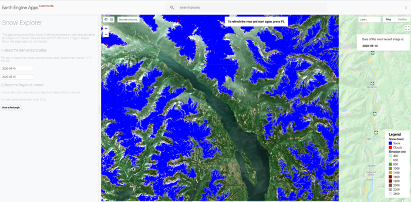

# SnowExplorer
## Description of the tool
SnowExplorer is a Google Earth Engine  based application for mapping snow on the ground. The tool is intended to help BCTS staff to plan their field visits by providing information on the Snow Cover Extent at specific dates and location. 

The tool is accessible at this address: https://labiadhmoez.users.earthengine.app/view/snowexplorer

***Please note that the tool doesn’t work on Internet Explorer. Use Google Chrome or Firefox to access the tool.***

## Snow Detection Algorithm
The algorithm is inspired and adapted from:
> Gascoin, S., Grizonnet, M., Bouchet, M., Salgues, G., and Hagolle, O.: Theia Snow collection: high-resolution operational snow cover maps from Sentinel-2 and Landsat-8 data, Earth Syst. Sci. Data, 11, 493–514, https://doi.org/10.5194/essd-11-493-2019, 2019. https://www.earth-syst-sci-data.net/11/493/2019/ 

The Algorithm is based on Sentinel-2 Level-2A Surface Reflectance product. The algorithm for Cloud and Snow detection are set as follow:
*Cloud Mask:  [MSK_CLDPRB >= 90%] OR [(MSK_CLDPRB >= 50%) AND (B8 >= 0.3)]                       OR  [(MSK_CLDPRB >= 20%) AND (B8 >= 0.9)]
with “MSK_CLDPRB” is the Cloud Probability band and “B8” is the Reflectance in the Near-infrared band (at 0.86 μm).

*Snow Mask: (NDSI >= 0.3) AND (B4 >= 0.14)
with “NDSI” is the Normalized Difference Snow Index and “B4” is Reflectance in the Red  band (at 0.66 μm) . 
     NDSI = (B3 – B11) / (B3 + B11)
with “B3” is the Reflectance in Green band (at 0.55 μm) and “B11” is the Reflectance in the Shortwave infrared band (at 1.61 μm).

